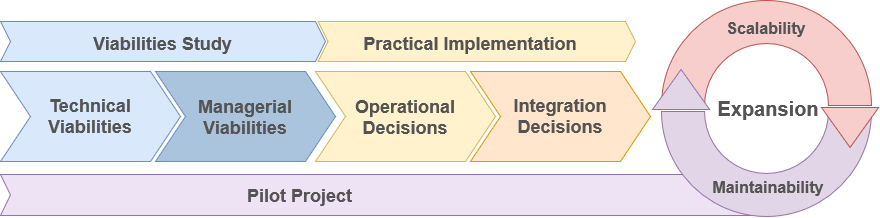

# Guidelines for Adoption Micro-frontend (GAM)

## Introduction

Welcome to the Guidelines for Adoption Micro-frontend (GAM), a comprehensive resource to guide the development, implementation, and expansion of Micro-Frontends architecture.

## Microfrontend

In this section, we provide an overview of Micro-Frontends architecture, highlighting its advantages and how it transforms the traditional approach to user interface development.

## GET STARTED

### Viabilities Study

Before starting implementation, conducting a comprehensive feasibility study is crucial. This section covers the following perspectives:

- **Technical Feasibility:** Explores technical aspects related to Micro-Frontends implementation, including technology choices, tool integration, and infrastructure requirements.

- **Managerial Feasibility:** Highlights strategic and financial considerations, alignment with organizational goals, costs, budgeting, change management, and training.

### Implementation

This stage is divided into two subsections:

- **Operational:** Details the practical implementation of Micro-Frontends, including development best practices, directory structure, and integration with CI/CD tools.

- **Integration:** Addresses strategies to efficiently integrate Micro-Frontends with existing systems, ensuring a smooth transition and interoperability.

### Expansion

When considering architecture expansion, we address:

- **Scalability:** Explores strategies to scale the Micro-Frontends architecture as the project grows, maintaining performance and efficiency.

- **Maintainability:** Highlights practices to ensure that the architecture remains easy to maintain and evolve over time.

## Pilot Project

Finally, we discuss the importance of conducting a pilot project before full deployment. This allows testing the architecture in a controlled environment, identifying specific challenges, and refining the overall strategy.

## How to Use This Guide

1. Explore relevant sections to understand different aspects of Micro-Frontends architecture.

2. Follow practical recommendations and examples for successful implementation.

3. Contribute feedback, suggestions, or improvements by opening issues or submitting pull requests.

## License

This guide is distributed under the [MIT License](LICENSE).

### Installation

bash
$ npm install

or

bash
$ yarn install

### Basic usage

bash
#### dev server with hot reload at http://localhost:3000
$ npm start

or 

bash
#### dev server with hot reload at http://localhost:3000
$ yarn start

Navigate to [http://localhost:3000](http://localhost:3000). The app will automatically reload if you change any of the source files.

#### Build

Run build to build the project. The build artifacts will be stored in the build/ directory.

bash
#### build for production with minification
$ npm run build

or

bash
#### build for production with minification
$ yarn build

##License

This guide is distributed under the [MIT](LICENSE).